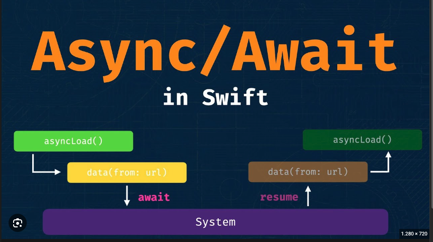

# Unlocking Swift's Concurrency Potential with Async/Await

Concurrency plays a vital role in building modern, responsive, and performant applications. With the introduction of async/await in Swift 5.5, developers now have a powerful tool at their disposal to simplify asynchronous programming and handle concurrent tasks more efficiently.  In this blog post, brought to you by Zen8labs, we will dive deep into mastering concurrency in Swift with async/await, exploring its advanced features, best practices, and practical use cases.



## Understanding Async/Await:

Before we delve into mastering concurrency with `async/await`, let's briefly recap its core concepts. `async/await` is a language-level feature that enables developers to write asynchronous code in a more sequential and synchronous style. By marking functions as asynchronous using the `async` keyword and using the `await` keyword to pause execution until a result is available, `async/await` eliminates the complexities of nested callbacks and closures, making code more readable and maintainable.

## Advanced Features of Async/Await:

To harness the full power of concurrency in Swift, let's explore some advanced features of async/await.

### Structured Concurrency:

Swift's Task API provides structured concurrency, allowing you to create and manage concurrent tasks. By using `Task.detached` or `TaskGroup`, you can spawn independent tasks that execute concurrently, ensuring proper resource management and error propagation.

```swift
func performTask() async {
    // Perform an independent task
    // ...
}

func executeConcurrentTasks() async {
    await withTaskGroup {
        group in
        await group.async {
            await performTask()
        }
        await group.async {
            await performTask()
        }
    }
    // Continue execution after both tasks complete
    // ...
}
```

### Cancellation

Async/await supports task cancellation, enabling you to cancel tasks that are no longer needed. By calling `task.cancel()`, you can gracefully stop task execution and free up system resources.

```swift
func performTask() async {
    // Check if cancellation is requested
    if Task.isCancelled {
        // Clean up and return early
        return
    }

    // Perform the task
    // ...
}

func executeTask() async {
    let task = Task {
        await performTask()
    }

    // Cancel the task if needed
    task.cancel()
}
```

### Task Prioritization

You can prioritize tasks to ensure critical tasks are executed promptly. By assigning priority levels using `Task(priority:)`, you can control the order in which tasks are executed and optimize resource allocation.

```swift
func performTask(priority: TaskPriority) async {
    // Perform the task with the given priority
    // ...
}

func executeTasks() async {
    await withTaskGroup(of: Void.self) {
        group in
        await group.async(priority: .high) {
            await performTask(priority: .high)
        }
        await group.async(priority: .low) {
            await performTask(priority: .low)
        }
    }
    // Continue execution after both tasks complete
    // ...
}
```

### Async Sequences

Swift's async sequences allow you to work with a stream of values asynchronously. You can use AsyncSequence and AsyncIteratorProtocol to iterate over asynchronous sequences, opening up new possibilities for working with data streams.

```swift
struct DataStream: AsyncSequence {
   typealias Element = Int

   struct AsyncIterator: AsyncIteratorProtocol {
       var current = 0

       mutating func next() async throws -> Int? {
           if current < 5 {
               await Task.sleep(1_000_000_000) // Simulate an asynchronous delay
               let result = current
               current += 1
               return result
           } else {
               return nil
           }
       }
   }

   func makeAsyncIterator() -> AsyncIterator {
       return AsyncIterator()
   }
}

func processValue(value: Int) async {
   // Process the value asynchronously
   // ...
}

func iterateDataStream() async {
   for await value in DataStream() {
       await processValue(value: value)
   }
   // Continue execution after processing all values
   // ...
}
```

## Best Practices for Mastering Concurrency

To master concurrency in Swift with async/await, it's essential to follow some best practices:

1. **Decompose Complex Tasks**: Break down complex tasks into smaller, more manageable subtasks. This improves code readability, testability, and reusability. Consider using functions, closures, or async sequences to modularize your code.
2. **Prioritize Responsiveness**: Concurrency should focus on enhancing the responsiveness of your applications. Identify critical sections that require concurrency and prioritize their execution. This ensures a smooth user experience, especially in UI-related tasks.
3. **Error Handling**: Pay careful attention to error handling in async/await code. Swift's structured error handling provides a robust mechanism to catch and propagate errors. Use do-catch blocks to handle errors appropriately and ensure graceful recovery.
4. **Performance Optimization**: While async/await simplifies concurrency, it's still important to optimize performance. Profile your code, identify potential bottlenecks, and consider techniques like lazy initialization, caching, and efficient resource management to improve performance.

## Practical Use Cases

1. Concurrency with async/await unlocks a wide range of use cases. Here are a few practical examples:
2. Networking: Asynchronous network requests, parallel image downloads, and data processing pipelines can all benefit from the streamlined code structure provided by `async/await`.
3. User Interfaces: Concurrency enhances UI responsiveness by offloading heavy tasks, such as data loading or image processing, to background threads while keeping the UI thread responsive.
4. Data Processing: `Async/await` simplifies working with large datasets, enabling concurrent data processing, such as filtering, mapping, or reducing operations.
5. Multiplatform Development: With the advent of SwiftUI and the convergence of iOS and macOS development, `async/await` provides a unified approach to handle asynchronous tasks across multiple Apple platforms.

## References

To provide a comprehensive understanding of concurrency in Swift with async/await, we have referenced various resources and documentation. Here are some key references that you can explore for further learning:

### Swift Documentation - Concurrency

Apple's official documentation on concurrency in Swift provides detailed information about async/await, structured concurrency, task cancellation, and more. You can find comprehensive guides, code examples, and API references at [https://developer.apple.com/documentation/swift/concurrency](https://developer.apple.com/documentation/swift/concurrency).

### WWDC Videos

Apple's Worldwide Developers Conference (WWDC) sessions offer valuable insights into Swift concurrency. The following WWDC videos cover async/await and related topics:

1. **"Meet async/await in Swift"**: This video introduces async/await and demonstrates its usage in various scenarios. [https://developer.apple.com/videos/play/wwdc2021/10132](https://developer.apple.com/videos/play/wwdc2021/10132)
2. **"Swift concurrency: Update a sample app"**: Discover Swift concurrency in action [https://developer.apple.com/videos/play/wwdc2021/10194/
   ](https://developer.apple.com/videos/play/wwdc2021/10194/)

### Swift Forums

The Swift Forums are an excellent resource for discussions and community support on Swift concurrency. You can browse topics related to async/await, ask questions, and gain insights from experienced developers. Visit [https://forums.swift.org/c/development/async-await](https://forums.swift.org/c/development/async-await) to explore the async/await discussions.

### Swift Evolution Proposals

To understand the design decisions and evolution of async/await in Swift, you can refer to the Swift Evolution proposals. The proposal SE-0296 "Async/await" introduces the async/await syntax and explains the rationale behind its implementation. Read the proposal at [https://github.com/apple/swift-evolution/blob/main/proposals/0296-async-await.md](https://github.com/apple/swift-evolution/blob/main/proposals/0296-async-await.md).

### Open-source Projects and Tutorials

Exploring open-source projects and tutorials can provide practical examples and insights into real-world usage of async/await in Swift. Websites like GitHub, Swift by Sundell [https://www.swiftbysundell.com](https://www.swiftbysundell.com), and Hacking with Swift [https://www.hackingwithswift.com](https://www.hackingwithswift.com) offer a wealth of resources to deepen your understanding and gain hands-on experience.


## Conclusion

Mastering concurrency in Swift with `async/await` empowers developers to build highly responsive, scalable, and efficient applications. By understanding the advanced features, following best practices, and leveraging practical use cases, you can unlock the full potential of `async/await`.

Concurrency is a fundamental aspect of modern application development, and async/await in Swift provides a powerful and intuitive way to tackle it. Embrace the benefits of async/await, experiment with its advanced features, and continuously refine your approach to concurrency to create exceptional Swift applications.

Happy mastering!

## About Zen8labs

Zen8Labs adopts cutting-edge technology practices and tools to ensure alignment of winning business solutions and impactful optimization. A wealth of experience driving efficiencies and innovation allows us to bring that perspective into executing strategic outcomes and building high-performing delivery capability.

Putting our customers at the center of our strategy and design helps differentiate the experiences across business domains, geographies, and cultures.
